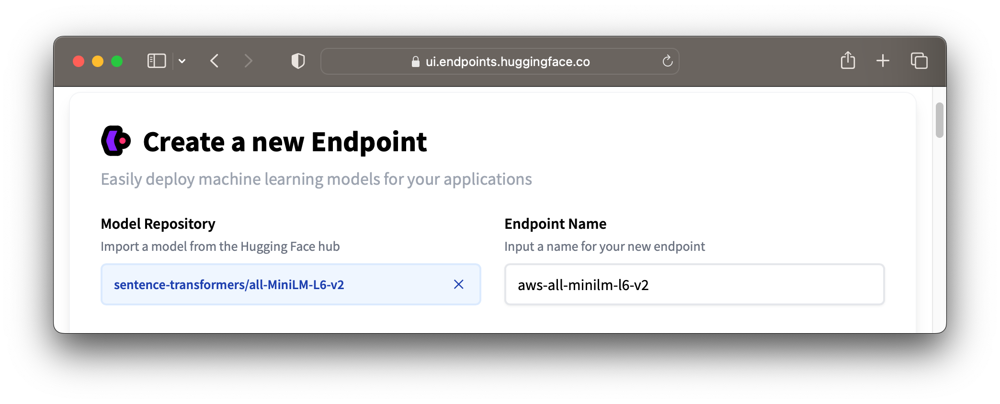
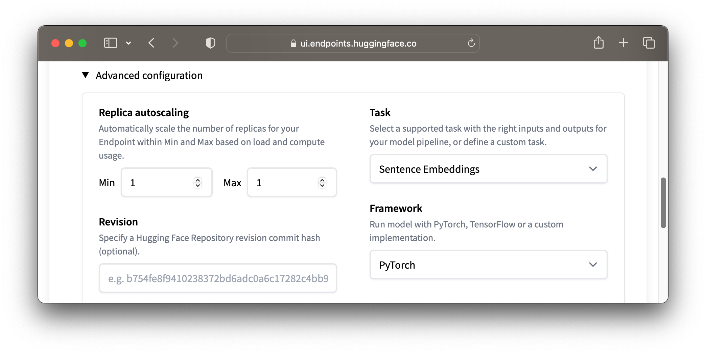

# Integration: Hugging Face Inference Endpoints

This guide will walk you through an example integration of the Hugging Face Inference API with vecs. We will create embeddings using Hugging Face's `sentence-transformers/all-MiniLM-L6-v2` model, insert these embeddings into a PostgreSQL database using vecs, and then query vecs to find the most similar sentences to a given query sentence.

## Create a Hugging Face Inference Endpoint

Head over to [Hugging Face's inference endpoints](https://ui.endpoints.huggingface.co/endpoints) and select `New Endpoint`.


Configure your endpoint with your model and provider of choice. In this example we'll use `sentence-transformers/all-MiniLM-L6-v2` and `AWS`.



Under "Advanced Configuration" select "Sentence Embeddings" as the "Task". Then click "Create Endpoint"




Once the endpoint starts up, take note of the `Endpoint URL`


!!! tip

    Don't forget to pause or delete your Hugging Face Inference Endpoint when you're not using it

Finally, [create and copy an API key](https://huggingface.co/settings/tokens) we can use to authenticate with the inference endpoint.

## Create an Environment

Next, you need to set up your environment. You will need Python 3.7+ with the vecs and requests installed.

```bash
pip install vecs requests
```

You'll also need [a Postgres Database with the pgvector extension](hosting.md)

## Create Embeddings

We can use the Hugging Face endpoint to create embeddings for a set of sentences.

```python
import requests
import json

huggingface_endpoint_url = '<HUGGINGFACE-ENDPOINT-URL>'
huggingface_api_key = '<HUGGINGFACE-API-KEY>'

dataset = [
    "The cat sat on the mat.",
    "The quick brown fox jumps over the lazy dog.",
    "Friends, Romans, countrymen, lend me your ears",
    "To be or not to be, that is the question.",
]

records = []

for sentence in dataset:
    response = requests.post(
        huggingface_endpoint_url,
        headers={
            "Authorization": f"Bearer {huggingface_api_key}",
            "Content-Type": "application/json"
        },
        json={"inputs": sentence}
    )
    embedding = response.json()["embeddings"]
    records.append((sentence, embedding, {}))
```

## Store the Embeddings with vecs

Now that we have our embeddings, we can insert them into a PostgreSQL database using vecs subbing in your DB_CONNECTION string.

```python
import vecs

DB_CONNECTION = "postgresql://<user>:<password>@<host>:<port>/<db_name>"

# create vector store client
vx = vecs.Client(DB_CONNECTION)

# create a collection named 'sentences' with 384 dimensional vectors (default dimension for paraphrase-MiniLM-L6-v2)
sentences = vx.get_or_create_collection(name="sentences", dimension=384)

# upsert the embeddings into the 'sentences' collection
sentences.upsert(vectors=records)

# create an index for the 'sentences' collection
sentences.create_index()
```


## Querying for Most Similar Sentences

Finally, we can query vecs to find the most similar sentences to a given query sentence. The query sentence is embedded using the same method as the sentences in the dataset, then we query the `sentences` collection with vecs.

```python
query_sentence = "A quick animal jumps over a lazy one."

# create an embedding for the query sentence
response = requests.post(
    huggingface_endpoint_url,
    headers={
        "Authorization": f"Bearer {huggingface_api_key}",
        "Content-Type": "application/json"
    },
    json={"inputs": query_sentence}
)
query_embedding = response.json()["embeddings"]

# query the 'sentences' collection for the most similar sentences
results = sentences.query(
    query_vector=query_embedding,
    limit=3,
    include_value = True
)

# print the results
for result in results:
    print(result)
```

Returns the most similar 3 records and theirdistance to the query vector.

```text
('The quick brown fox jumps over the lazy dog.', 0.256648302882697)
('The cat sat on the mat.', 0.78635900041167)
('To be or not to be, that is the question.', 1.04114070479544)
```
